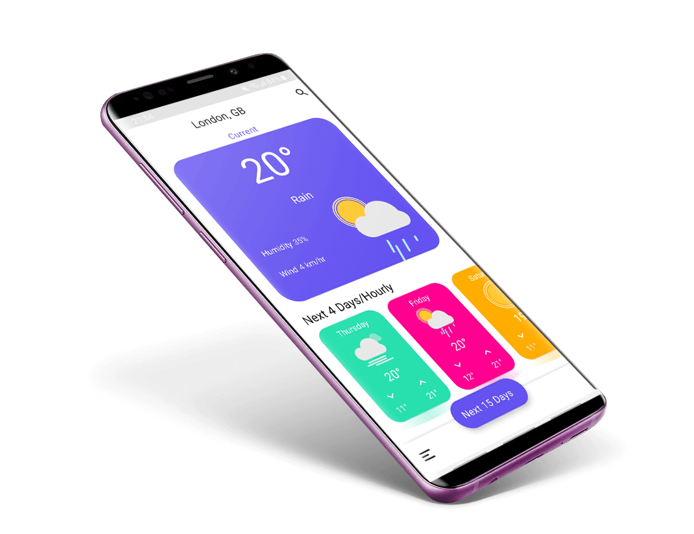
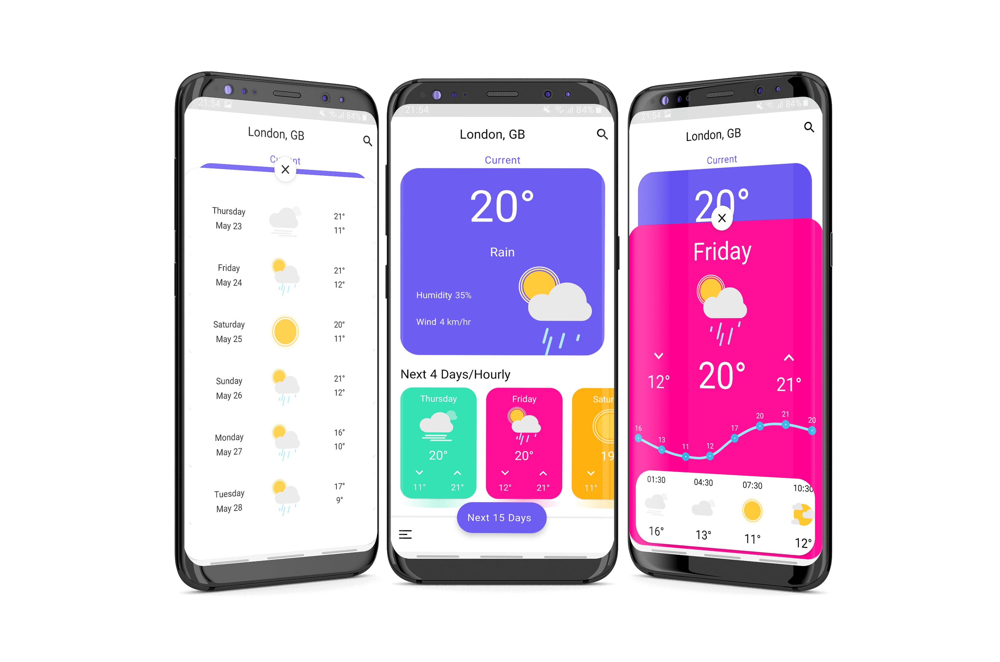

# Weather app

**Requirements**
- Android Studio 4.0.0
- JDK 8
- Android SDK 29
- Supports API Level +21
- Material Components 1.3.0-alpha01

**Highlights**
- Use [OpenWeatherMap] API
- Use Material Design 2
- Dark Mode
- Support two language. English & Persian
- Use locale Database

**Demo** application is available in [Release]

**Screenshot**

**Libraries & Dependencies**
- [Support libraries]: appcompat / recyclerview / constraintlayout
- [Material Design 2]: MaterialCardView / MaterialButton / Bottom App Bars / ExtendedFloatingActionButton
- [FastAdapter]: The bullet proof, fast and easy to use adapter library, which minimizes developing time to a fraction
- [Calligraphy3]: Custom fonts in Android the easy way
- Square [Retrofit] / [Okhttp] / [Logging-Interceptor]
- [ObjextBox]: ObjectBox is a superfast lightweight database for objects
- [RxAndroid] Reactive Extensions for Android
- [Glide]: An image loading and caching library for Android focused on smooth scrolling
- [Lottie-Android]: Render After Effects animations natively on Android
- [MaterialSearchView]: Cute library to implement SearchView in a Material Design Approach
- [MPAndroidChart]: A powerful & easy to use chart library for Android
- [Firebase Core] / Crashlytics

**Credit**

### This app inspired from [Weather App Freebie] concept Designed by [Raman Yv] 

# License

    Copyright 2019 Behrouz Khezry

    Licensed under the Apache License, Version 2.0 (the "License");
    you may not use this file except in compliance with the License.
    You may obtain a copy of the License at

       http://www.apache.org/licenses/LICENSE-2.0

    Unless required by applicable law or agreed to in writing, software
    distributed under the License is distributed on an "AS IS" BASIS,
    WITHOUT WARRANTIES OR CONDITIONS OF ANY KIND, either express or implied.
    See the License for the specific language governing permissions and
    limitations under the License.
    
[Weather App Freebie]: https://www.uplabs.com/posts/weather-app-freebie    
[Raman Yv]: https://www.uplabs.com/ramandesigns9    
[OpenWeatherMap]: https://openweathermap.org/
[Support libraries]: https://developer.android.com/jetpack/androidx/
[Material Design 2]: https://material.io/develop/android/
[FastAdapter]: https://github.com/mikepenz/FastAdapter
[Calligraphy3]: https://github.com/InflationX/Calligraphy
[Retrofit]: https://github.com/square/retrofit
[Okhttp]: https://github.com/square/okhttp
[Logging-Interceptor]: https://github.com/square/okhttp/tree/master/okhttp-logging-interceptor
[ObjextBox]: https://github.com/objectbox/objectbox-java
[RxAndroid]: https://github.com/ReactiveX/RxAndroid
[Glide]: https://github.com/bumptech/glide
[Lottie-Android]: https://github.com/airbnb/lottie-android
[MaterialSearchView]: https://github.com/MiguelCatalan/MaterialSearchView
[MPAndroidChart]: https://github.com/PhilJay/MPAndroidChart
[Firebase Core]: https://firebase.google.com/
[ButterKnife]: https://github.com/JakeWharton/butterknife
[Release]: https://github.com/bkhezry/weather/releases
